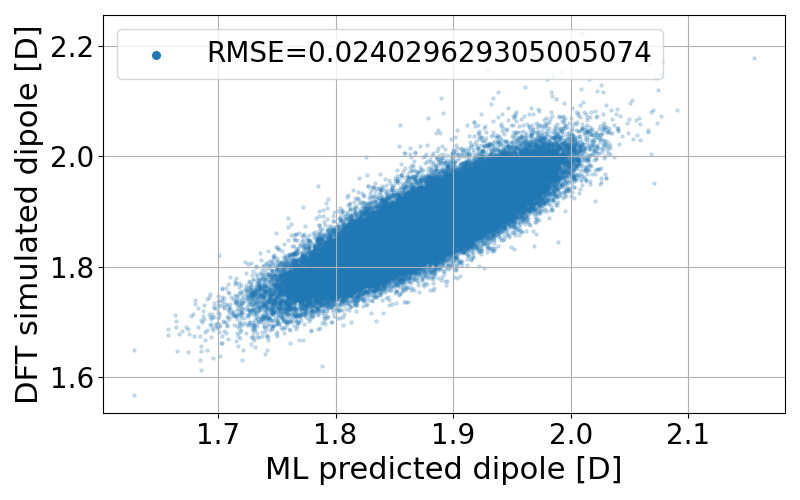
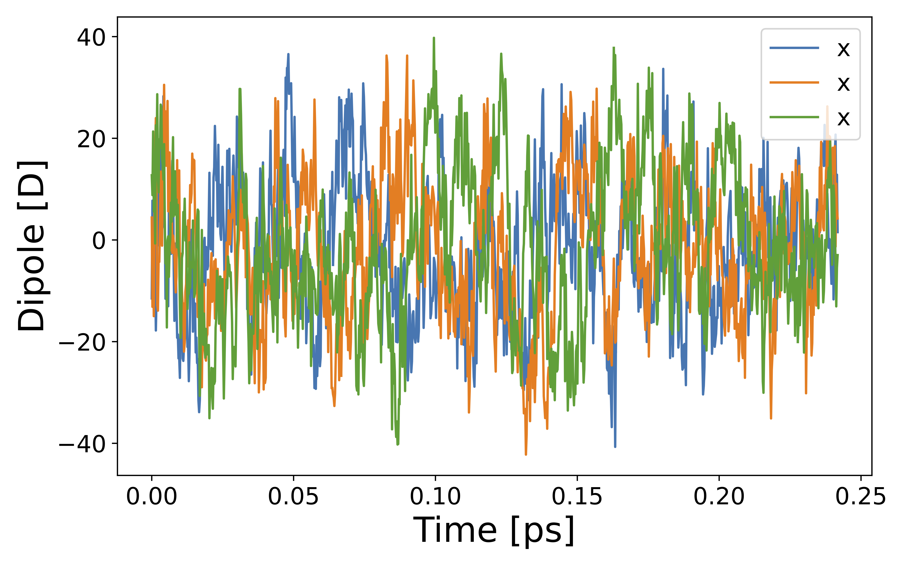
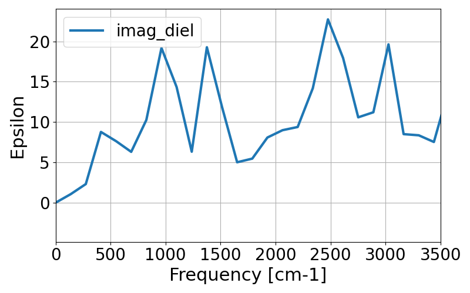

###################################################################
Getting-started tutorial No. 1: Liquid methanol
###################################################################

In this tutorial, we train ML dipole models of liquid methanol. 

*************************************
Required data for calculations
*************************************

To train ML models for dipole moment, we only need two files:

* atomic coordinates with Wannier centers
* molecular structure (chemical bond information)

The first file is assumed to be the ``extended xyz`` format via ``ase`` package, which also contains the supercell information. The second file should be a standard ``mol`` file to be processed using ``rdkit``. We prepared a simple example using the isolated methanol system for this tutorial. Necessary files are included in this repository. Let's go to `tutorial/tutorial1/`.

.. code-block:: bash

    $cd examples/tutorial/tutorial1/
    $tree 
    ├── IONS+CENTERS+cell_sorted_merge.xyz -> ../../CPtrain/cptrain_train/IONS+CENTERS+cell_sorted_merge.xyz
    ├── config.yaml
    ├── methanol.mol
    └── train.yaml

xyz format atomic structures for training data
---------------------------------------------------

The order of atoms should satisfy three things

* The atomic order must be molecule-by-molecule.
* The atomic order in each molecule should be the same as the ``*.mol`` file. 
* The WCs should come last.

If you see the first 8 lines of ``methanol.xyz``, you can find ``C``, four ``H``, and ``O``. The Wannier centers (WC) are represented as `X`. There are the atoms and WCs included in a single MD step. 

.. code-block:: bash

    $ cat methanol.xyz
    416
    Lattice="12.911606431431386 0.0 0.0 0.0 12.911606431431386 0.0 0.0 0.0 12.911606431431386" Properties=species:S:1:pos:R:3 pbc="T T T"
    C       10.70302493      10.85955260       8.68064224
    O        9.72875172      10.09124538       9.38880112
    H       10.70478669      10.62022413       7.61094586
    H       11.69788485      10.69544339       9.10099246
    H       10.46045016      11.94347292       8.76860487
    H        9.43087091      10.68001118      10.11893151

They are visualized using `nglview` package via jupyter notebook as follows. 

.. code-block:: python

        %pip install nglview
        %pip install ase
		import nglview as nv
		import ase.io

        # read all the trajectory. 
        # If you want to extract a single step instead, try like ase.io.read("filename", index=1)
		aseatoms = ase.io.read("mol_wan.xyz",index=":")

        # This if for list of ase.atoms. If you want to see single ase.atom, use nv.show_ase.
		w = nv.show_asetraj(aseatoms,gui=True)
		w.clear_representations()
		w.add_label(radius=0.2,color="black",label_type="atom")
		w.add_ball_and_stick("_He",color="green",radius=0.004,aspectRatio=50)
		w.add_ball_and_stick("_Ne",color="cyan",radius=0.004,aspectRatio=50)
		w.add_ball_and_stick("_Ar",color="green",radius=0.004,aspectRatio=50)
		#w.add_ball_and_stick("_Li",color="cyan",radius=0.1)
		#w.add_ball_and_stick("_Be",color="blue",radius=0.1)
		w.add_ball_and_stick("_H")
		w.add_ball_and_stick("_C")
		w.add_ball_and_stick("_O")
		w.add_ball_and_stick("_N")

		w.add_unitcell()
		w.update_unitcell()
		w

We have ``10000`` MD steps in the file, which will be used for both training and validation data for ML.

.. code-block:: python

    # see how many steps in the aseatoms
    print(len(aseatoms))

Mol file for bond information
---------------------------------------

Next, we dig into the ``*.mol`` file, which contains molecular structures including atomic and bonding information. 

.. code-block:: bash

    $ cat methanol.mol
    6  5  0  0  0  0  0  0  0  0999 V2000
        0.9400    0.0200   -0.0900 C   0  0  0  0  0  0  0  0  0  0  0  0
        0.4700    0.2700   -1.4000 O   0  0  0  0  0  0  0  0  0  0  0  0
        0.5800   -0.9500    0.2400 H   0  0  0  0  0  0  0  0  0  0  0  0
        0.5700    0.8000    0.5800 H   0  0  0  0  0  0  0  0  0  0  0  0
        2.0400    0.0200   -0.0900 H   0  0  0  0  0  0  0  0  0  0  0  0
        0.8100    1.1400   -1.6700 H   0  0  0  0  0  0  0  0  0  0  0  0
    1  5  1  0  0  0  0
    1  3  1  0  0  0  0
    1  4  1  0  0  0  0
    2  1  1  0  0  0  0
    6  2  1  0  0  0  0
    M  END

The second to seventh lines are called atom block, which contain atomic coordinates and species in a single molecule. We only use atomic species for training. The following data is called atom block, representing bonding information. 

.. code-block:: bash

    1  5  1  0  0  0  0

For example, the above line means the first and fifth atom (C and H) have a chemical bond. In other words, the atoms with first two numbers have a chemical bond. The ``*.mol`` format is a standard format for molecular structures, and you can easily find information on it.

*************************************
Model training
*************************************

Prepare input parameters
------------------------------

To train models, we implemented ``CPtrain.py`` command written in python. The command requires a ``yaml`` format file to specify parameters. Here is an example:

.. code-block:: yaml

    model:
        modelname: test  # specify name
        nfeature:  288   # length of descriptor
        M:         20    # M  (embedding matrix size)
        Mb:        6     # Mb (embedding matrix size, smaller than M)

    learning_rate:
        type: fix

    loss:
        type: mse        # mean square error

    data:
        type: xyz        # or xyz
        file:
            - "IONS+CENTERS+cell_sorted_merge.xyz"
        itp_file: methanol.mol
        bondtype: ch

    training:
        device:     cpu # Torchのdevice
        batch_size: 32  # batch size for training 
        validation_batch_size: 32 # batch size for validation
        max_epochs: 40
        learning_rate: 1e-2 # starting learning rate
        n_train:    900    # the number of training data
        n_val:      100    # the number of validation data
        modeldir:  model_test # directory to save models
        restart:   False    # If restart training 

Parameters written above are basically necessary values (not optional). The input file consists of four parts:

+----------------+------------------------+
|  part name     | explanation            |            
+================+========================+
| model          |  ML model parameters   | 
+----------------+------------------------+
| learning_rate  | learning rate          | 
+----------------+------------------------+
| loss           | loss function          |
+----------------+------------------------+
| data           | training data          | 
+----------------+------------------------+
| training       | training parameters    |
+----------------+------------------------+

As Basic explanations are given above, we only add some important notes.

* model

    * Model parameters (``nfeature``, ``M``, ``Mb``) given above are basically enough for simple gas/liquid molecules. Although the detailed meanings of the parameters will be given later, we emphasize that ``Mb`` should be smaller than ``M`` by definition, and that `nfeature` should be a multiple of ``4``.
    * ``modelname`` is just used for file names, so you can use any word as you like.

* learning_rate

    * Currently, we only support fixed learning rate. 

* loss

    * Currently, We only support Mean Squared Error (MSE) as a loss function.

* data

    * Training data should be ``descriptor`` or ``xyz``. In this tutorial, we use ``xyz`` type.
    * If training data type is ``descriptor``, the descriptor file name should be :code:`*_descs.npy`, and the true file name should be :code:`*_true.npy`.
    * ``bondtype`` defines which bond to be trained. The value is one of ``CH``, ``CO``, ``OH``, ``CC``, or ``O``.

* training

    * ``device`` is the same as ``pytorch``'s device for model training. You can use `cpu`, `cuda`, or `mps`.
    * ``modeldir`` specifies the directory to which model files will be saved.

Train a model
----------------------

After the training script is prepared, we can start the training by simply running

.. code-block:: bash

    CPtrain.py train -i input.yaml

The code generates ``stdout`` like 

.. code-block:: bash

    your python version is ...  3 11

    *****************************************************************
                        CPtrain.py
                        Version. 0.0.1
    *****************************************************************

    2024-05-27 23:21:32,907 root mltrain [INFO]: Start logging
    {'model': {'modelname': 'test', 'nfeature': 288, 'M': 20, 'Mb': 6}, 'learning_rate': {'type': 'fix'}, 'loss': {'type': 'mse'}, 'data': {'type': 'xyz', 'file': ['IONS+CENTERS+cell_sorted_merge.xyz'], 'itp_file': 'methanol.mol'}, 'training': {'device': 'cpu', 'batch_size': 32, 'validation_batch_size': 32, 'max_epochs': 40, 'learning_rate': '1e-2', 'n_train': 900, 'n_val': 100, 'modeldir': 'model_test', 'restart': False}}
    model NET :: nfeatures ::  288
    nfeatures_enet :: 72
    nfeatures_fnet :: 120
    =================================================================
    Layer (type:depth-idx)                   Param #
    =================================================================
    NET_withoutBN                            --
    ├─Linear: 1-1                            3,650
    ├─Linear: 1-2                            2,550
    ├─Linear: 1-3                            73,440
    ├─Linear: 1-4                            6,050
    ├─Linear: 1-5                            2,550
    ├─Linear: 1-6                            1,020
    =================================================================
    Total params: 89,260
    Trainable params: 89,260
    Non-trainable params: 0
    =================================================================
    2024-05-27 23:21:32,927 root mltrain [INFO]:  --------------------------------------
    data type :: xyz
    -----  ml.read_mol :: parse results... -------
    bonds_list ::  [[0, 4], [0, 2], [0, 3], [1, 0], [5, 1]]
    counter    ::  6
    atom_list  ::  ['C', 'O', 'H', 'H', 'H', 'H']
    -----------------------------------------------
    ================
    CH bonds...       [[0, 4], [0, 2], [0, 3]]
    CO bonds...       [[1, 0]]
    OH bonds...       [[5, 1]]
    OO bonds...       []
    CC bonds...       []
    CC ring bonds...  []

    ==================
    ring_bond_index  []
    ch_bond_index    [0, 1, 2]
    oh_bond_index    [4]
    co_bond_index    [3]
    cc_bond_index    []
    ================
    O atoms (lonepair)...       [1]
    N atoms (lonepair)...       []
    C atoms ...                 [0]
    H atoms ...                 [2, 3, 4, 5]
    C 0.94 0.02 -0.09
    O 0.47 0.27 -1.4
    -----  ml.read_mol :: parse results... -------
    representative_atom_index  :: 1
    -----------------------------------------------
    ================
    coh_index/coc_index :: [oの番号, {coボンドの番号(co_bond_indexの0から数えていくつか),ohボンドの番号}]
    TODO :: もしかしたらbond_indexを使った方が全体的にやりやすいかもしれない
    coh_index :: [[0, {'CO': 0, 'OH': 0}]]
    coc_index :: []
    Loading xyz file ::  ['IONS+CENTERS+cell_sorted_merge.xyz']
    len xyz == 1
    2024-05-27 23:21:34,561 root mltrain [INFO]:  -----------------------------------------------------------------
    2024-05-27 23:21:34,561 root mltrain [INFO]:  ---Summary of DataSystem: training     ----------------------------------
    2024-05-27 23:21:34,561 root mltrain [INFO]: found 1 system(s):
    2024-05-27 23:21:34,561 root mltrain [INFO]:                         system  natoms  bch_sz   n_bch
    2024-05-27 23:21:34,561 root mltrain [INFO]: IONS+CENTERS+cell_sorted_merge.xyz    1000      32      31
    2024-05-27 23:21:34,562 root mltrain [INFO]: --------------------------------------------------------------------------------------
    splitting atoms into atoms and WCs
    Assigning Wannier Centers
    Finish Assigning Wannier Centers
    2024-05-27 23:22:28,891 Trainer __init__ [INFO]: model data will be saved to model_test
    =================================================================
    Layer (type:depth-idx)                   Param #
    =================================================================
    NET_withoutBN                            --
    ├─Linear: 1-1                            3,650
    ├─Linear: 1-2                            2,550
    ├─Linear: 1-3                            73,440
    ├─Linear: 1-4                            6,050
    ├─Linear: 1-5                            2,550
    ├─Linear: 1-6                            1,020
    =================================================================
    Total params: 89,260
    Trainable params: 89,260
    Non-trainable params: 0
    =================================================================

    2024-05-27 23:22:28,892 Trainer init_model [INFO]: Torch device (cpu or cuda gpu or m1 mac gpu): cpu
    2024-05-27 23:22:29,384 numexpr.utils _init_num_threads [INFO]: Note: NumExpr detected 16 cores but "NUMEXPR_MAX_THREADS" not set, so enforcing safe limit of 8.
    2024-05-27 23:22:29,384 numexpr.utils _init_num_threads [INFO]: NumExpr defaulting to 8 threads.
    2024-05-27 23:22:29,556 Trainer set_dataset [INFO]:  n_traing ( number of training  data): 900
    2024-05-27 23:22:29,556 Trainer set_dataset [INFO]:  n_val    ( number of validatin data): 100
    ^@2024-05-27 23:23:05,110 Trainer epoch_step [INFO]: epoch= 1 : time= 35.553799867630005 [s] : loss(train)= 0.0030520600183600827 : loss(valid)= 0.0028606270595143237 : RMSE[D](train)= 0.0551564542987999 : RMSE[D](valid)= 0.05347409362915805
    model is saved to model_test_tmp1.pt at model_test
    2024-05-27 23:23:41,283 Trainer epoch_step [INFO]: epoch= 2 : time= 36.05292296409607 [s] : loss(train)= 0.002742534619756043 : loss(valid)= 0.002425628947094083 : RMSE[D](train)= 0.05222889056766713 : RMSE[D](valid)= 0.04924118021059818
    model is saved to model_test_tmp2.pt at model_test
    2024-05-27 23:24:17,498 Trainer epoch_step [INFO]: epoch= 3 : time= 36.17855882644653 [s] : loss(train)= 0.0027552477217146327 : loss(valid)= 0.0023257903133829436 : RMSE[D](train)= 0.05240615377016262 : RMSE[D](valid)= 0.04821778239842708
    model is saved to model_test_tmp3.pt at model_test
    2024-05-27 23:24:52,931 Trainer epoch_step [INFO]: epoch= 4 : time= 35.389596939086914 [s] : loss(train)= 0.002701992983929813 : loss(valid)= 0.002566932700574398 : RMSE[D](train)= 0.051863416078856424 : RMSE[D](valid)= 0.0505809825728987
    model is saved to model_test_tmp4.pt at model_test
    2024-05-27 23:25:28,712 Trainer epoch_step [INFO]: epoch= 5 : time= 35.72677397727966 [s] : loss(train)= 0.0026170784757206483 : loss(valid)= 0.0026297084211061397 : RMSE[D](train)= 0.05109348549317842 : RMSE[D](valid)= 0.05118794610165333
    model is saved to model_test_tmp5.pt at model_test
    2024-05-27 23:26:02,858 Trainer epoch_step [INFO]: epoch= 6 : time= 34.10452723503113 [s] : loss(train)= 0.002519122832122126 : loss(valid)= 0.002710235926012198 : RMSE[D](train)= 0.05010292158956631 : RMSE[D](valid)= 0.05182654546680134
    model is saved to model_test_tmp6.pt at model_test
    2024-05-27 23:26:36,344 Trainer epoch_step [INFO]: epoch= 7 : time= 33.43118190765381 [s] : loss(train)= 0.002488897938746959 : loss(valid)= 0.002438249376912912 : RMSE[D](train)= 0.04980324078916386 : RMSE[D](valid)= 0.04936132032714493
    model is saved to model_test_tmp7.pt at model_test
    2024-05-27 23:27:09,524 Trainer epoch_step [INFO]: epoch= 8 : time= 33.13404870033264 [s] : loss(train)= 0.0024281473555934747 : loss(valid)= 0.0024121985770761967 : RMSE[D](train)= 0.049172273966610065 : RMSE[D](valid)= 0.04911379181779723
    model is saved to model_test_tmp8.pt at model_test
    2024-05-27 23:27:42,988 Trainer epoch_step [INFO]: epoch= 9 : time= 33.424768924713135 [s] : loss(train)= 0.0024187416752933393 : loss(valid)= 0.00232696447831889 : RMSE[D](train)= 0.04911207242387859 : RMSE[D](valid)= 0.04820846097177897
    model is saved to model_test_tmp9.pt at model_test
    2024-05-27 23:28:17,375 Trainer epoch_step [INFO]: epoch= 10 : time= 34.339770793914795 [s] : loss(train)= 0.002027994516538456 : loss(valid)= 0.0020500118068108955 : RMSE[D](train)= 0.04497044101939407 : RMSE[D](valid)= 0.045273193022861896
    model is saved to model_test_tmp10.pt at model_test
    2024-05-27 23:28:50,388 Trainer epoch_step [INFO]: epoch= 11 : time= 32.96853709220886 [s] : loss(train)= 0.0018060718056014074 : loss(valid)= 0.0015387694584205747 : RMSE[D](train)= 0.042402016109021445 : RMSE[D](valid)= 0.0391866800126098
    model is saved to model_test_tmp11.pt at model_test
    2024-05-27 23:29:23,494 Trainer epoch_step [INFO]: epoch= 12 : time= 33.06202292442322 [s] : loss(train)= 0.0015744604378206922 : loss(valid)= 0.001602462415272991 : RMSE[D](train)= 0.03961410282709073 : RMSE[D](valid)= 0.03996957523043282
    model is saved to model_test_tmp12.pt at model_test
    2024-05-27 23:29:56,833 Trainer epoch_step [INFO]: epoch= 13 : time= 33.296122789382935 [s] : loss(train)= 0.0015049170885634208 : loss(valid)= 0.0015406373422592878 : RMSE[D](train)= 0.03872750117829672 : RMSE[D](valid)= 0.039230152528586505
    model is saved to model_test_tmp13.pt at model_test
    2024-05-27 23:30:30,009 Trainer epoch_step [INFO]: epoch= 14 : time= 33.13048601150513 [s] : loss(train)= 0.0014625149363252734 : loss(valid)= 0.0013872180522109072 : RMSE[D](train)= 0.038211363274244604 : RMSE[D](valid)= 0.03717074105946483
    model is saved to model_test_tmp14.pt at model_test
    2024-05-27 23:31:03,023 Trainer epoch_step [INFO]: epoch= 15 : time= 32.970470905303955 [s] : loss(train)= 0.0012952481338288635 : loss(valid)= 0.0011708201685299475 : RMSE[D](train)= 0.03594431862161766 : RMSE[D](valid)= 0.034191540839132055
    model is saved to model_test_tmp15.pt at model_test
    2024-05-27 23:31:37,101 Trainer epoch_step [INFO]: epoch= 16 : time= 34.034749031066895 [s] : loss(train)= 0.0012781490970935141 : loss(valid)= 0.0012487516505643725 : RMSE[D](train)= 0.03567568660112371 : RMSE[D](valid)= 0.03530874235402812
    model is saved to model_test_tmp16.pt at model_test
    2024-05-27 23:32:10,323 Trainer epoch_step [INFO]: epoch= 17 : time= 33.178393840789795 [s] : loss(train)= 0.0012396411870473198 : loss(valid)= 0.0012016038332755368 : RMSE[D](train)= 0.0351610294889353 : RMSE[D](valid)= 0.0346635038703976
    model is saved to model_test_tmp17.pt at model_test
    2024-05-27 23:32:43,535 Trainer epoch_step [INFO]: epoch= 18 : time= 33.16394877433777 [s] : loss(train)= 0.0012235958503359662 : loss(valid)= 0.0012918139109387994 : RMSE[D](train)= 0.03492190754501672 : RMSE[D](valid)= 0.03592647573961546
    model is saved to model_test_tmp18.pt at model_test
    2024-05-27 23:33:16,961 Trainer epoch_step [INFO]: epoch= 19 : time= 33.37561392784119 [s] : loss(train)= 0.0012278797990542703 : loss(valid)= 0.0012458103786533077 : RMSE[D](train)= 0.03499613492118348 : RMSE[D](valid)= 0.035192720360356027
    model is saved to model_test_tmp19.pt at model_test
    2024-05-27 23:33:50,577 Trainer epoch_step [INFO]: epoch= 20 : time= 33.57127404212952 [s] : loss(train)= 0.0012240493794836635 : loss(valid)= 0.001295727367202441 : RMSE[D](train)= 0.03495633493656875 : RMSE[D](valid)= 0.03591999197134574
    model is saved to model_test_tmp20.pt at model_test
    2024-05-27 23:34:23,622 Trainer epoch_step [INFO]: epoch= 21 : time= 32.997060775756836 [s] : loss(train)= 0.0012256120015600963 : loss(valid)= 0.0011909629683941603 : RMSE[D](train)= 0.03495001219865892 : RMSE[D](valid)= 0.03448448842303
    model is saved to model_test_tmp21.pt at model_test
    2024-05-27 23:34:56,853 Trainer epoch_step [INFO]: epoch= 22 : time= 33.18896174430847 [s] : loss(train)= 0.0012167344518404985 : loss(valid)= 0.0012835346860811114 : RMSE[D](train)= 0.034833311084896894 : RMSE[D](valid)= 0.03577993540008407
    model is saved to model_test_tmp22.pt at model_test
    2024-05-27 23:35:29,807 Trainer epoch_step [INFO]: epoch= 23 : time= 32.91186189651489 [s] : loss(train)= 0.0011236058489885181 : loss(valid)= 0.0011108355053390067 : RMSE[D](train)= 0.03343205283435263 : RMSE[D](valid)= 0.03328191643945063
    model is saved to model_test_tmp23.pt at model_test
    2024-05-27 23:36:03,022 Trainer epoch_step [INFO]: epoch= 24 : time= 33.170867919921875 [s] : loss(train)= 0.001198199895692856 : loss(valid)= 0.0011316734598949552 : RMSE[D](train)= 0.03454902092721321 : RMSE[D](valid)= 0.03361872941420203
    model is saved to model_test_tmp24.pt at model_test
    2024-05-27 23:36:36,357 Trainer epoch_step [INFO]: epoch= 25 : time= 33.290594816207886 [s] : loss(train)= 0.0011569774401972868 : loss(valid)= 0.00125562238584583 : RMSE[D](train)= 0.03398148767577144 : RMSE[D](valid)= 0.03526287444169499
    model is saved to model_test_tmp25.pt at model_test
    2024-05-27 23:37:09,678 Trainer epoch_step [INFO]: epoch= 26 : time= 33.2756552696228 [s] : loss(train)= 0.0010826434694796003 : loss(valid)= 0.0012303667608648539 : RMSE[D](train)= 0.03285225680652831 : RMSE[D](valid)= 0.0350027180085837
    model is saved to model_test_tmp26.pt at model_test
    2024-05-27 23:37:43,053 Trainer epoch_step [INFO]: epoch= 27 : time= 33.32958698272705 [s] : loss(train)= 0.001173686479367981 : loss(valid)= 0.0010828875432101388 : RMSE[D](train)= 0.034169700120643916 : RMSE[D](valid)= 0.03287867522535803
    model is saved to model_test_tmp27.pt at model_test
    2024-05-27 23:38:19,747 Trainer epoch_step [INFO]: epoch= 28 : time= 36.647231101989746 [s] : loss(train)= 0.001116036980030393 : loss(valid)= 0.0012196329965566595 : RMSE[D](train)= 0.03330824263660591 : RMSE[D](valid)= 0.03489144527681723
    model is saved to model_test_tmp28.pt at model_test
    2024-05-27 23:38:59,670 Trainer epoch_step [INFO]: epoch= 29 : time= 39.88249492645264 [s] : loss(train)= 0.0011180073737965099 : loss(valid)= 0.0012258108084400494 : RMSE[D](train)= 0.03336500989034002 : RMSE[D](valid)= 0.03500258438073604
    model is saved to model_test_tmp29.pt at model_test
    2024-05-27 23:39:49,398 Trainer epoch_step [INFO]: epoch= 30 : time= 49.675516843795776 [s] : loss(train)= 0.0010629503813106567 : loss(valid)= 0.0010745280305854976 : RMSE[D](train)= 0.03253391709756107 : RMSE[D](valid)= 0.03270917398237465
    model is saved to model_test_tmp30.pt at model_test
    2024-05-27 23:40:26,195 Trainer epoch_step [INFO]: epoch= 31 : time= 36.73529386520386 [s] : loss(train)= 0.0010963863585077757 : loss(valid)= 0.001109493294886003 : RMSE[D](train)= 0.03305228076125506 : RMSE[D](valid)= 0.03320700290457949
    model is saved to model_test_tmp31.pt at model_test
    2024-05-27 23:41:06,045 Trainer epoch_step [INFO]: epoch= 32 : time= 39.80792784690857 [s] : loss(train)= 0.001064531773278889 : loss(valid)= 0.0011376045683088403 : RMSE[D](train)= 0.032547290130018745 : RMSE[D](valid)= 0.03362633110102043
    model is saved to model_test_tmp32.pt at model_test
    2024-05-27 23:41:46,186 Trainer epoch_step [INFO]: epoch= 33 : time= 40.091362953186035 [s] : loss(train)= 0.0010355500500216813 : loss(valid)= 0.0009315957043630382 : RMSE[D](train)= 0.03212837784581807 : RMSE[D](valid)= 0.030487922940679202
    model is saved to model_test_tmp33.pt at model_test
    2024-05-27 23:42:21,759 Trainer epoch_step [INFO]: epoch= 34 : time= 35.53277611732483 [s] : loss(train)= 0.0009523128766366946 : loss(valid)= 0.0008897289323310057 : RMSE[D](train)= 0.030749915142596514 : RMSE[D](valid)= 0.029788555875735753
    model is saved to model_test_tmp34.pt at model_test
    2024-05-27 23:42:57,443 Trainer epoch_step [INFO]: epoch= 35 : time= 35.59277606010437 [s] : loss(train)= 0.0009194710645325748 : loss(valid)= 0.0008036431002741059 : RMSE[D](train)= 0.030231966427741203 : RMSE[D](valid)= 0.028328095215842314
    model is saved to model_test_tmp35.pt at model_test
    2024-05-27 23:43:34,729 Trainer epoch_step [INFO]: epoch= 36 : time= 37.2429301738739 [s] : loss(train)= 0.0008694644493516535 : loss(valid)= 0.0008589115265446404 : RMSE[D](train)= 0.02939380869049454 : RMSE[D](valid)= 0.029268487767904347
    model is saved to model_test_tmp36.pt at model_test
    2024-05-27 23:44:10,015 Trainer epoch_step [INFO]: epoch= 37 : time= 35.23839807510376 [s] : loss(train)= 0.0008100573946389236 : loss(valid)= 0.0007349376101046801 : RMSE[D](train)= 0.02839690322675918 : RMSE[D](valid)= 0.0270813759830895
    model is saved to model_test_tmp37.pt at model_test
    2024-05-27 23:44:46,935 Trainer epoch_step [INFO]: epoch= 38 : time= 36.876343965530396 [s] : loss(train)= 0.0008246830173967672 : loss(valid)= 0.0007781900543098649 : RMSE[D](train)= 0.028661926251427983 : RMSE[D](valid)= 0.027891913603732336
    model is saved to model_test_tmp38.pt at model_test
    2024-05-27 23:45:27,108 Trainer epoch_step [INFO]: epoch= 39 : time= 40.12124514579773 [s] : loss(train)= 0.0008413328593763124 : loss(valid)= 0.0008210245287045836 : RMSE[D](train)= 0.028899934585797222 : RMSE[D](valid)= 0.02863102027700547
    model is saved to model_test_tmp39.pt at model_test
    2024-05-27 23:46:17,073 Trainer epoch_step [INFO]: epoch= 40 : time= 49.92154312133789 [s] : loss(train)= 0.0008217944268835708 : loss(valid)= 0.0008133725496008992 : RMSE[D](train)= 0.028557669288744897 : RMSE[D](valid)= 0.028495248694122847
    model is saved to model_test_tmp40.pt at model_test
    model is saved to model_test_weight.pth at model_test
    model is saved to model_test_all.pth at model_test
    model is saved to model_test.pt at model_test

To train models for all the chemical bond species, We iteratively run the command with modifying the input of ``bondtype``.

Test a model
----------------------

We can check the quality of the trained model using a `yaml` structure file.

.. code-block:: bash

    CPtrain.py test -m chmodel_test/model_ch_python.pt -x IONS+CENTERS+cell_sorted_merge.xyz -m methanol.mol

It takes a few minutes to complete the calculation. The code generates two figures and two text files. The figures are the correlation between the predicted and true dipole moments (and the absolute value of the dipole moment). The text files named ``pred_list.txt`` and ``true_list.txt`` contain the predicted dipole moments and the true dipole moments, and they are visualized in ``pred_true_norm.png`` and ``pred_true_density.png``.

******************************************
Calculate dipoles along MD trajectories
******************************************

After constructing four dipole moment models (``CH``, ``CO``, ``OH``, and ``O``) and validating our trained model works well, we try our model on molecular dynamics trajectories using C++ interface. Let us go to the example directory

.. code-block:: bash

    cd examples/dieltools/methanol

The input file for the C++ code is given in ``yaml`` format and is as follows.

.. code-block:: yaml
    :caption: input.yaml

    general:
        itpfilename: methanol.acpype/input_GMX.mol
        bondfilename: methanol.mol
        savedir: dipole_10ps/
        temperature: 300
        timestep: 0.242
    descriptor:
        calc: 1
        directory: ./
        xyzfilename: IONS+CENTERS+cell_sorted_merge.xyz
        savedir: dipole_10ps/
        descmode: 2
        desctype: allinone
        haswannier: 1   # if WCs are in xyz, set 1
        interval: 1
        desc_coh: 0
    predict:
        calc: 1
        desc_dir: dipole_10ps/
        model_dir: model_rotate_methanol/
        modelmode: rotate
        bondspecies: 4
        save_truey: 0

The input composes of three part, ``general``, ``descripter``, and ``predict``. The details of the parameters are given bellow.

* general

    * itpfilename[required]: ``mol`` file for the molecule. (methanol in our case)
    * savedir[required]:     The directory to which all the outputs will be saved.
    * temperature[optional]: We can optionally set the temperature to calculate dielectric properties. The default is 300 [Kelvin]
    * timestep[optional]:    We can optionally set the MD timestep to calculate dynamical dielectric properties.

* descripter

    * calc[required]: 1 for doing calculation, 0 for skip calculation.
    * directory[required]: The directory in which the input xyz is stored.
    * xyzfilename[required]: The input xyz filename.
    * desctype[required]: The type of descriptor. Currently we have ``allinone`` and ``old``.

* predict:
    * calc: 1
    * desc_dir: dipole_10ps/
    * model_dir: /home/k0151/k015124/c++/20231025_model_rotate_methanol/
    * modelmode: rotate
    * bondspecies: 4
    * save_truey: 0

You can perform C++ calculations with enabling OpenMP. For example, you can set the number of threads to 12 by running 

.. code-block:: bash

    export OMP_NUM_THREADS=12
    dieltools config.yaml

After the calculation, the following result files are saved in the directory specified by ``savedir``. 

* ``total_dipole.txt``: system total dipole.
* ``mol_wan.xyz``: atomic and predicted WCs configurations in ``xyz`` format.
* ``DIELCONST``: dielectric constant and average molecular dipole.

We can visualize the system dipole moment along the MD trajectory using ``total_dipole.txt`` to see if our calculation success.

.. code-block:: python
    
    CPextract.py diel total -F dipole_10ps/total_dipole.txt

Finally, we perform Fourier transformation of the total dipole moments to calculate the dielectric function via ``CPextract.py`` command. You must specify the high-frequency dielectric constant with ``-E`` option

.. code-block:: bash

    CPextract.py diel spectra -F total_dipole.txt -E 1.76624 -s 0 -w 1

The above command generate three files:

* ``total_dipole.txt_diel.csv``: real and imaginary parts of the dielectric function.
* ``total_dipole.txt_refractive.csv``: real and imaginary parts of the complex refractive index.
* ``total_dipole.txt_alphan.csv``: absorption spectra ``alpha(\omega)*n(\omega)``.

Here we visualize the imaginary part of the dielectric function using the following python script.

.. code-block:: python

    import matplotlib as mpl
    import matplotlib.pyplot as plt
    import numpy as np
    import pandas as pd
    # load data
    df = pd.read_csv("dipole_10ps/total_dipole.txt_diel.csv")

    # figure instantce
    fig, ax = plt.subplots(figsize=(8,5),tight_layout=True)
    ax.plot(df["freq_kayser"], df["imag_diel"],label="imag_diel",lw=3)
    ax.set_xlim(0,3500)
    # 
    xticklabels = ax.get_xticklabels()
    yticklabels = ax.get_yticklabels()
    xlabel="Frequency [cm-1]"
    ylabel="Epsilon"

    # 
    ax.set_xlabel(xlabel,fontsize=22)
    ax.set_ylabel(ylabel,fontsize=22)
    ax.grid()
    ax.tick_params(axis='x', labelsize=20 )
    ax.tick_params(axis='y', labelsize=20 )
    lgnd=ax.legend(loc="upper left",fontsize=20)
    # lgnd.legendHandles[0]._sizes = [30]
    # lgnd.legendHandles[0]._alpha = [1.0]
    fig.savefig("imag_diel.png")

As the MD trajectory is too short, we can not get meaningful spectra. We will acquire better one in the following tutorials.