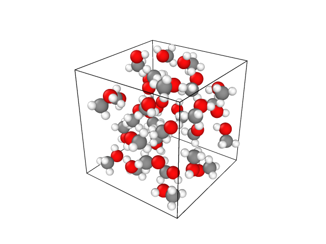

###################################################################
Getting-started tutorial No. 3: Liquid water : dielectric spectra
###################################################################

In this tutorial, we are going to calculate the dielectric constant & function of liquid water.

****************
Tutorial data
****************

The reference files of this tutorial are given in ``examples/tutorial/3_liquidmethanol/`` directory. 

*************************
Prepare training data 
*************************

The acquisition of the training data requires two steps: generation of the structure and calculation of the Wannier centers. In the case of liquid structures, the acquisition of the structure is done with classical MD and only the Wannier center calculation is done with DFT due to computational cost considerations.

GROMACS calculation for structure sampling
===============================================

Here we show the workflow using GROMACS, although other packages are possible.

Convert smiles to topology files
----------------------------------------

To begin with, we build an initial structure for classical molecular dynamics. 

.. code-block:: bash

    $cat methanol.csv
    Smiles,Name,density
    CO,METHANOL,0.791

Unlike DFT calculations, you need to generate force field parameters for classical MD. The procedure depends on which software you use.
Here is an example for ``GROMACS`` calculations. We use ``openbabel`` and ``acpype`` package.

.. code-block:: bash

    $obabel -ismi methanol.csv -O methanol.mol --gen3D --conformer --nconf 5000 --weighted 
    $acpype -s 86400 -i methanol.mol -c bcc -n 0 -m 1 -a gaff2 -f -o gmx -k "qm_theory='AM1', grms_tol=0.05, scfconv=1.d-10, ndiis_attempts=700, "
    $obabel -i gro methanol.acpype/methanol_GMX.gro -o mol -O methanol_GMX.mol
    $obabel -i gro methanol.acpype/methanol_GMX.gro -o pdb -O methanol_GMX.pdb

Generated ``input_GMX.itp`` is the topology file.

.. note::
    For mac OS users, ``openbabel`` and ``acpype`` are installed as

    .. code-block:: bash

        $brew install open-babel
        $conda install -c conda-forge acpype

Generate liquid structure
----------------------------------------

There are several methods to make liquid structures from a single molecule structure. Here we use ``packmol`` to achieve this.
We use the experimental density of ``0.791[g/cm^3]``, resulting in the cell parameter of ``12.91[nm]`` with ``32`` molecules.

.. code-block:: bash

    $packmol < packmol.inp

.. gmx insert-molecules -box 1.291 1.291 1.291 -ci methanol.acpype/methanol_GMX.gro -nmol 32 -try 20 -o methanol_liquid.gro

.. note:: 
    For mac OS users, ``packmol`` is installed via ``homebrew`` as 

    .. code-block:: bash

        $brew install packmol

Finally, we add the cell information to the generated ``methanol_liquid.pdb`` file using 

.. code-block:: bash
    
    $gmx editconf -f methanol_liquid.pdb  -box 1.291 1.291 1.291 -o init.gro

We note that ``GROMACS`` uses ``nm`` instead of ``Angstrom`` for the length unit.

Prepare input parameter files
------------------------------------------

Let us go to the ``cmd/`` directory. The input file ``em.mdp`` for energy minimization is given below. 

.. code-block:: bash

    ; VARIOUS PREPROCESSING OPTIONS
    ;title                    = Yo
    ;cpp                      = /usr/bin/cpp
    include                  =
    define                   =

    ; RUN CONTROL PARAMETERS
    integrator               = steep
    nsteps                   = 1000000
    emtol                    = 10
    emstep                   = 0.1
    nstlist                  = 1
    cutoff-scheme            = verlet
    vdw-type                 = cut-off
    rlist                    = 0.6
    rvdw                     = 0.6
    rcoulomb                 = 0.6

The input file ``run.mdp`` for production run is given below. We calculate ``10,000,000`` steps and sample every ``1,000`` steps to minimize correlation between structures, obtaining a total of ``10,000`` structures.

.. code-block:: bash

    ; VARIOUS PREPROCESSING OPTIONS
    ;title                    = Yo
    ;cpp                      = /usr/bin/cpp
    include                  =
    define                   =

    ; RUN CONTROL PARAMETERS
    constraints              = none
    integrator               = md
    nsteps                   = 10000000
    dt                       = 0.001
    nstlist                  = 1
    rlist                    = 0.6
    rvdw                     = 0.6
    rcoulomb                 = 0.6
    coulombtype              = pme
    cutoff-scheme            = verlet
    vdw-type                 = cut-off
    tc-grps                  = system
    tau-t                    = 0.1
    gen-vel                  = yes
    gen-temp                 = 298.15
    ref-t                    = 298.15
    Pcoupl                   = no
    Tcoupl                    = v-rescale
    nstenergy                = 1000
    nstxout                  = 1000
    nstfout                  = 1000
    DispCorr                 = EnerPres

Run GROMACS
----------------------------------------

Let us run classical molecular dynamics simulations.

.. code-block:: bash

    #grompp for making input file
    mpiexec -n 1 gmx_mpi grompp -f em.mdp -p system.top -c  ../make_itp/init.gro -o em.tpr -maxwarn 10
    #mdrun for equilibration
    mpiexec -n 8 gmx_mpi mdrun -s em.tpr -o em.trr -e em.edr -c em.gro -nb cp
    #grompp for making input file
    mpiexec -n 1 gmx_mpi grompp -f run.mdp -p system.top -c em.gro -o eq.tpr -maxwarn 1
    #mdrun for production
    mpiexec -n 8 gmx_mpi mdrun -s eq.tpr -o eq.trr -e eq.edr -c eq.gro -nb cpu
    #making final output
    mkdir ./inputs/
    echo "System" > ./inputs/anal.txt
    mpiexec -n 1 gmx_mpi trjconv -s eq.tpr -f eq.trr -dump 0 -o eq.pdb < ./inputs/anal.txt
    mpiexec -n 1 gmx_mpi trjconv -s eq.tpr -f eq.trr -pbc mol -force -o eq_pbc.trr < ./inputs/anal.txt

CPMD calculation for Wannier centers
===============================================

Let us go to the ``cpmd/`` directory.

 Prepare input for CPMD
----------------------------------------

After finishing GROMACS calculations, we will use the following script to make ``10,000`` input files for CPMD.

.. code-block:: python
    :caption: make_bulkjobinput_from_gromacs.py

    import ase
    import mdtraj
    import os
    import cpmd.converter_cpmd
    # load GROMACS trajectory
    traj=mdtraj.load("eq_pbc.trr", top="eq.pdb")

    num_config = len(traj)
    print("The number of configurations :: {0}".format(num_config))
    assert num_config == 10001 # check if gromacs completely finish

    os.system("mkdir bulkjob")
    for i in range(num_config):
        os.system("mkdir bulkjob/struc_{}".format(str(i)))
        traj[i].save_gro("bulkjob/struc_{}/final_structure.gro".format(str(i)))
        ase_atoms=ase.io.read("bulkjob/struc_{}/final_structure.gro".format(str(i)))
        makeinput=cpmd.converter_cpmd.make_cpmdinput(ase_atoms)
        makeinput.make_bomd_oneshot(type="sorted")
        os.system("mv bomd-oneshot.inp bulkjob/struc_{}/bomd-oneshot.inp".format(str(i)))
        os.system("mv sort_index.txt   bulkjob/struc_{}/sort_index.txt".format(str(i)))
        os.system("mkdir bulkjob/struc_{}/tmp".format(str(i)))

    print(" -------------------- ")
    print("finish making bulkjob inputs !! ")

.. note::

   Generated inputs are just samples. You should tune parameters for serious calculations.

We create ``tmp/`` and ``pseudo/`` directories in each ``bulkjob/struc_*`` directory to stock outputs and pseudo potentials, respectively. You also have to prepare ``C_MT_GIA_BLYP``, ``O_MT_GIA_BLYP``, and ``H_MT_BLYP.psp`` from CPMD pseudo potential directories and store them in ``pseudo/`` directory.

Run CPMD
----------------------------------------

We execute ``10000`` scf calculations as follows.

.. code-block:: bash

    for i in {1..10000};
    do
        cd bulkjob/struc_${i}
        mpirun cpmd.x bomd-oneshot.inp >> bomd-oneshot.out
        cd ../../
    done;

After the calculation, we gather ``IONS+CENTERS.xyz`` in ``bulkjob/struc_*`` directories into a single ``IONS+CENTERS_merge.xyz`` file.

.. code-block:: bash

    NUM=10000
    for i in `eval echo {0..$NUM}`;
    do
        cat bulkjob/struc_${i}/IONS+CENTERS.xyz >> IONS+CENTERS_merge.xyz

Postprocess CPMD data
----------------------------------------

``IONS+CENTERS_merge.xyz`` does not include the lattice information, which we need to add manually. We can use ``CPextract.py`` to do this.

.. code-block:: bash

    $CPextract.py cpmd addlattice -i IONS+CENTERS_merge.xyz -s bulkjob/struc_1/bomd-wan-restart.out IONS+CENTERS_merge_cell.xyz

Second, we will re-sort the atomic orders in the file.

.. code-block:: bash

    $CPextract.py cpmd sort -i IONS+CENTERS_merge_cell.xyz -s bulkjob/struc_1/sort_index.txt IONS+CENTERS_merge_cell_sorted.xyz

Train models
===============================================

Let us go to the ``train/`` directory. 

Train models
--------------------

The previously prepared ``IONS+CENTERS_merge_cell_sorted.xyz`` and ``methanol.mol`` are used for training ML models. As methanol has ``CH``, ``CO``, ``OH`` bonds and ``O`` lone pair, we have to train four independent ML models. The input file for ``CPtrain.py`` is given in ``yaml`` format. 
The input file for the CH bond is as follows.

.. code-block:: yaml

    model:
    modelname: model_ch  # specify name
    nfeature:  288       # length of descriptor
    M:         20        # M  (embedding matrix size)
    Mb:        6         # Mb (embedding matrix size, smaller than M)

    learning_rate:
    type: fix

    loss:
    type: mse        # mean square error

    data:
    type: xyz
    file: 
        - "../cpmd/IONS+CENTERS+cell_sorted_merge.xyz"
    itp_file: ../make_itp/methanol_GMX.mol
    bond_type: CH # CH, CO, OH, O

    traininig:
    device:     cpu # Torch device (cpu/mps/cuda)
    batch_size: 32  # batch size for training 
    validation_vatch_size: 32 # batch size for validation
    max_epochs: 50
    learnint_rate: 1e-2 # starting learning rate
    n_train:   9000    # the number of training data
    n_val:     1000    # the number of validation data
    modeldir:  model_ch # directory to save models
    restart:   False    # If restart training 

For gas systems, we can reduce the model size without losing accuracy. 

We can train the CH bond model using ``CPtrain.py train`` command as follows.

.. code-block:: bash

    $CPtrain.py train -i input.yaml

After the training, RMSE should be about ``0.01[D]`` to ``0.05[D]`` for liquid systems.

Next, you can change ``modelname``, ``bond_type``, and ``modeldir`` to corresponding bonds, and re-run ``CPtrain.py`` to train other 4 models.

Test a model
----------------------

We can check the quality of the trained model as follows. 

.. code-block:: bash

    $CPtrain.py test -m model_ch/model_ch_python.pt -x ../cpmd/IONS+CENTERS_cell.xyz -i ../make_itp/methanol_GMX.mol

Calculate dielectric constant
=====================================

Let us go to the ``pred/`` directory. 

Run long classical molecular dynamics
---------------------------------------

As an example of a real-world application, we will calculate the dielectric constant of liquid methanol. The dielectric constant requires extremely long trajectories to converge.
Here we prepare a ``50ps`` trajectory containing ``500`` molecules using ``GROMACS``. Input files prepared in the directory.

.. code-block:: bash

    $tree
    ├── em.mdp
    ├── init.gro
    ├── run.mdp
    └── system.top
    └── make_xyz.py

We run the simulation using following commands. It takes long time to finish.

.. code-block:: bash

    #grompp for making input file
    mpiexec -n 1 gmx_mpi grompp -f em.mdp -p system.top -c  init.gro -o em.tpr -maxwarn 10
    #mdrun for equilibration
    mpiexec -n 8 gmx_mpi mdrun -s em.tpr -o em.trr -e em.edr -c em.gro -nb cp
    #grompp for making input file
    mpiexec -n 1 gmx_mpi grompp -f run.mdp -p system.top -c em.gro -o eq.tpr -maxwarn 1
    #mdrun for production
    mpiexec -n 8 gmx_mpi mdrun -s eq.tpr -o eq.trr -e eq.edr -c eq.gro -nb cpu
    #making final output
    mkdir ./inputs/
    echo "System" > ./inputs/anal.txt
    mpiexec -n 1 gmx_mpi trjconv -s eq.tpr -f eq.trr -dump 0 -o eq.pdb < ./inputs/anal.txt
    mpiexec -n 1 gmx_mpi trjconv -s eq.tpr -f eq.trr -pbc mol -force -o eq_pbc.trr < ./inputs/anal.txt

After the calculations, we have to change the format of output binary file (``eq_pbc.trr``) into the ``xyz`` format.

.. code-block:: python
    :caption: make_xyz.py

    def make_ase(symbols,positions,cell):
        from ase import Atoms 
        mols = Atoms(symbols=symbols,
                    positions=positions*10,  # nm(gro) to ang (ase)
                    cell= cell*10,
                    pbc=[1, 1, 1]) 
        return mols

    import mdtraj
    traj=mdtraj.load("eq_pbc.trr", top="eq.pdb")
    print("traj :: ", len(traj))

    # get cell
    UNITCELL_VECTORS=traj[-1].unitcell_vectors.reshape([3,3])

    # get symbols
    table, bonds =traj[-1].topology.to_dataframe()
    symbols=table['element']

    # get xyz
    traj_coords = traj.xyz

    import ase.io
    import ase

    # make list[atoms]
    answer_atomslist=[]
    for positions in traj_coords:
        aseatom=make_ase(symbols,positions,UNITCELL_VECTORS)
        answer_atomslist.append(aseatom)
    # save
    ase.io.write("gromacs_trajectory_cell.xyz",answer_atomslist)

    print("==========")
    print(" end ")

Predict dipole moment along the trajectory
--------------------------------------------

Finally, we predict the dipole moment along the MD trajectory. The input file for C++ interface is as follows.

.. code-block:: yaml
    :caption: config.yaml

    general:
        itpfilename: methanol.acpype/input_GMX.mol
        bondfilename: ../make_itp/methanol.acpype/methanol_GMX.mol
        savedir: dipole_50ns/
        temperature: 298
    descriptor:
        calc: 1
        directory: ./
        xyzfilename: gromacs_trajectory_cell.xyz
        savedir: dipole_50ns/
        descmode: 2
        desctype: allinone
        haswannier: 1
        interval: 1
        desc_coh: 0
    predict:
        calc: 1
        desc_dir: dipole_50ns/
        model_dir: 
        modelmode: rotate
        bondspecies: 4
        save_truey: 0

.. code-block:: bash

    $mkdir dipole_50ns/
    $dieltools config.yaml

We can check the dielectric constant in the ``DIELCONST`` file.

.. code-block:: bash

    $cat dipole_50ns/DIELCONST
    calculated mean dipole & dielectric constants
    WARNING eps^inf is fixed to 1.0, and we only support orthorhombic lattice.
     temperature                           298
     mean_absolute_mol_dipole          2.49343
     stderr_absolute_mol_dipole         0.266285
               mean_M2(<M^2>)          10367.5
               mean_M(<M>^2)           3.06974
               eps^0                   32.1915

The calculated dielectric constant is ``32.19``, which agrees well with the experimental value of ``32.66``.

.. Calculate dielectric function
.. =====================================

.. Next application goes to IR dielectric spectra of liquid methanol, which requires first-principles level accuracy for the dynamical trajectory part. 

.. To this end, we prepare 10ps CPMD trajectory without Wannier calculations, and predict dipole moments at each time step using our C++ interface.

